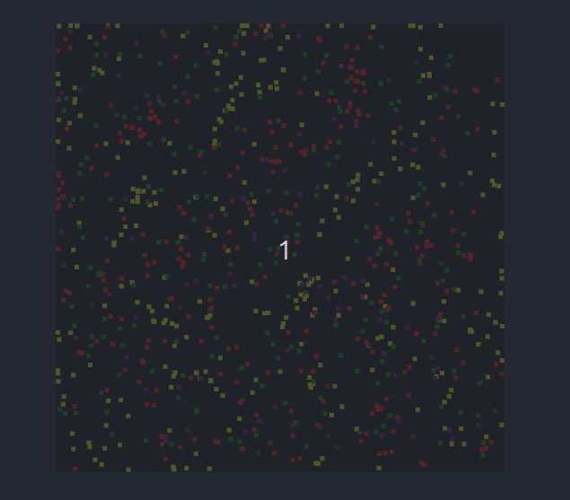
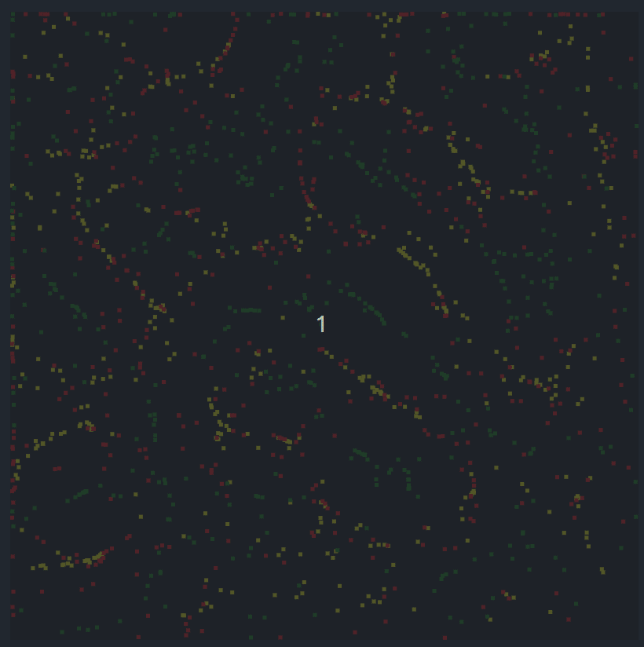
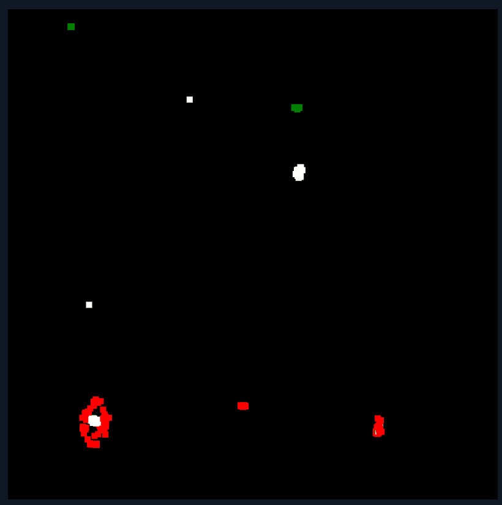

# artificial

Simple artificial life experiments with Canvas and TS.

#### Tags

### Version 0.0.1

Simple forces.

### Version 0.0.2

Eating and reproducing by proximity.

## Inspiration

Code based or inspired by:

* https://youtu.be/0Kx4Y9TVMGg
